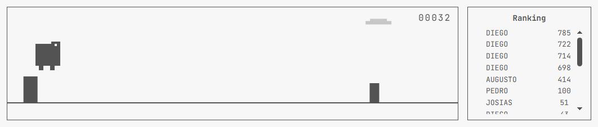
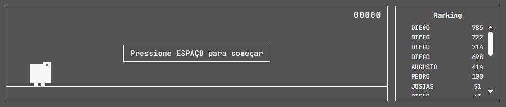

# Dino Runner — USTJ

Clone do jogo do dinossauro do Chrome (o famoso `chrome://dino`) escrito em HTML, CSS e
JavaScript puro, com placar global persistido no [Supabase](https://supabase.com).

Todo o jogo roda em um único `<canvas>` de 800×200, sem framework, bundler ou etapa de
build. A única dependência externa é o SDK do Supabase, carregado via CDN.



<p align="center"><em>O mesmo jogo em modo escuro:</em></p>



---

## Índice

- [Funcionalidades](#funcionalidades)
- [Stack e dependências](#stack-e-dependências)
- [Estrutura do projeto](#estrutura-do-projeto)
- [Configuração do Supabase](#configuração-do-supabase)
- [Rodando localmente](#rodando-localmente)
- [Como jogar](#como-jogar)
- [Mecânicas do jogo](#mecânicas-do-jogo)
- [Arquitetura do código](#arquitetura-do-código)
- [Ajustando o balanceamento](#ajustando-o-balanceamento)
- [Deploy](#deploy)
- [Solução de problemas](#solução-de-problemas)

---

## Funcionalidades

| Recurso | Descrição |
|---|---|
| **Gameplay clássico** | Dinossauro que corre, pula e se abaixa; cactos e pássaros em velocidade crescente. |
| **Ranking global** | Top 100 pontuações lidas e gravadas no Supabase, exibidas ao lado do jogo. |
| **Registro de nome** | Ao morrer, o jogador digita um nome (até 10 caracteres, salvo em maiúsculas) ou pula o envio. |
| **Recorde da sessão** | O melhor score da aba fica no HUD (`HI 00420`), guardado em `sessionStorage`. |
| **Modo escuro** | Botão fixo no canto superior direito; a preferência persiste em `localStorage`. |
| **Efeitos sonoros** | Som de pulo e arpejo de marco gerados em tempo real pela Web Audio API (nenhum arquivo de áudio). |
| **Marcos a cada 100 pontos** | A pontuação congela por ~2s, pisca em vídeo invertido e toca um arpejo. |
| **Acessível ao teclado** | Espaço/↑/W para pular, ↓/S para abaixar, Enter/Esc na tela de nome. |
| **Degradação segura** | Acessos a `localStorage`/`sessionStorage` são protegidos: em modo anônimo o jogo continua funcionando, só não persiste preferências. |

## Stack e dependências

- **HTML + CSS + JavaScript puro** — sem React, sem npm, sem build.
- **Canvas 2D** — toda a renderização (dino, cactos, pássaros, nuvens, chão).
- **Web Audio API** — osciladores `square` para o áudio estilo 8 bits.
- **[@supabase/supabase-js v2](https://github.com/supabase/supabase-js)** — via `cdn.jsdelivr.net`.
- **Fonte JetBrains Mono** — via Google Fonts.

Não há `package.json`, testes automatizados nem pipeline de CI neste repositório.

## Estrutura do projeto

```
dino-ustj/
├── index.html          # marcação: canvas, HUD, overlay de nome, painel de ranking
├── style.css           # visual monocromático + variantes de modo escuro (body.night)
├── script.js           # jogo completo: áudio, física, colisão, render, Supabase
├── config.js           # credenciais do Supabase (NÃO versionado — está no .gitignore)
├── config.example.js   # modelo do config.js
├── CLAUDE.md           # diretrizes de trabalho para assistentes de IA no repositório
└── .gitignore          # ignora config.js
```

A ordem das tags `<script>` no `index.html` importa: `supabase.js` (CDN) → `config.js`
(define as constantes globais) → `script.js` (consome as constantes). O `config.js` não
usa `export`, apenas `const` no escopo global de um script clássico.

## Configuração do Supabase

### 1. Crie o projeto e a tabela

No SQL Editor do seu projeto Supabase, execute:

```sql
create table public.leaderboard (
  id         bigint generated always as identity primary key,
  name       text        not null,
  score      integer     not null,
  created_at timestamptz not null default now()
);

-- índice para a consulta do ranking (order by score desc limit 100)
create index leaderboard_score_idx on public.leaderboard (score desc);

alter table public.leaderboard enable row level security;

-- leitura pública do ranking
create policy "leaderboard_select_public"
  on public.leaderboard for select
  to anon
  using (true);

-- qualquer visitante pode enviar a própria pontuação
create policy "leaderboard_insert_public"
  on public.leaderboard for insert
  to anon
  with check (true);
```

> Esse schema é o mínimo que o código atual exige: o `script.js` só lê `name` e `score` e
> só insere `{ name, score }`. As colunas `id` e `created_at` são conveniências
> recomendadas.

### 2. Aponte o jogo para o seu projeto

```bash
cp config.example.js config.js
```

Edite o `config.js` com os valores de **Project Settings → API**:

```js
const SUPABASE_URL = 'https://SEU-REF.supabase.co';
const SUPABASE_ANON_KEY = 'sua-anon-ou-publishable-key';
```

O `config.js` está no `.gitignore` justamente para que as credenciais de cada ambiente não
sejam commitadas. Ainda assim, lembre-se: a **anon key é pública por natureza** — ela vai
para o navegador de qualquer jogador. A proteção real vem das políticas de RLS acima, não
do sigilo da chave. Nunca use a `service_role` key aqui.

## Rodando localmente

Sirva a pasta por HTTP (abrir o `index.html` direto pelo `file://` pode quebrar as
chamadas ao Supabase por causa de CORS/origem nula):

```bash
# Python
python -m http.server 8000

# Node
npx serve .
```

Depois acesse <http://localhost:8000>.

## Como jogar

| Ação | Teclas / Mouse |
|---|---|
| Começar / Reiniciar | `Espaço`, `↑`, `W` ou clique no canvas |
| Pular | `Espaço`, `↑`, `W` ou clique no canvas |
| Abaixar | `↓` ou `S` (segure) |
| Salvar pontuação | `Enter` ou botão **Salvar** |
| Pular o envio | `Esc` ou botão **Pular** |
| Alternar modo escuro | Botão ☾ / ☼ no canto superior direito |

Durante a digitação do nome todos os atalhos de jogo ficam desativados — não dá para
pular sem querer enquanto se digita.

## Mecânicas do jogo

- **Pontuação:** cresce 0,15 por frame (~9 pontos/s a 60 fps) e satura em **9999**.
- **Velocidade:** `6 + min(score / 100, 6)` — acelera até dobrar e então estabiliza.
- **Obstáculos:** sorteio a cada spawn —
  - 25% pássaro (**só a partir de 300 pontos**),
  - ~35% grupo de 1 a 3 cactos pequenos,
  - ~40% cacto grande.
- **Pássaros em duas alturas:**
  - alto (`GROUND_Y - 60`): acerta o dino em pé → **abaixe**;
  - médio (`GROUND_Y - 38`): acerta em pé e abaixado → **pule**.
- **Espaçamento justo:** o intervalo entre obstáculos é medido em *frames de reação*
  (60 fixos + até 40 aleatórios) multiplicados pela velocidade atual, de modo que
  acelerar não torne o jogo impossível.
- **Marcos de 100 pontos:** a contagem congela por 120 frames, o placar pisca invertido e
  toca um arpejo C5-E5-G5-C6. O mundo continua se movendo durante o congelamento.
- **Colisão:** AABB com *hitboxes* encolhidas (6 px nas laterais do dino, 3 px nos
  obstáculos) para o clássico "passou raspando" a favor do jogador.

## Arquitetura do código

O `script.js` é um arquivo único, organizado em blocos nesta ordem:

1. **Referências do DOM** — todos os `getElementById` no topo.
2. **Áudio** (`getAudioContext`, `playTone`, `playJumpSound`, `playMilestoneSound`) —
   o `AudioContext` é criado sob demanda e retomado se estiver suspenso, respeitando a
   política de autoplay dos navegadores.
3. **Supabase** (`renderLeaderboard`, `saveScore`) — as duas únicas funções de rede.
4. **Constantes de balanceamento e paleta** — todo o ajuste fino do jogo mora aqui.
5. **Modo escuro** (`setDarkMode`) — alterna a classe `night` no `body` e no
   `#game-container`; o canvas lê as cores a partir da variável `darkMode` a cada frame.
6. **Estado do jogo** — variáveis soltas (`score`, `speed`, `obstacles`, `clouds`…).
7. **Ciclo de vida** (`resetGame`, `gameOver`, `submitName`, `skipNameEntry`).
8. **Entrada** — listeners de `keydown`, `keyup` e `mousedown`.
9. **Spawn, `update()` e funções de desenho** — `update` cuida de física, spawn, marcos e
   colisão; `draw` repinta o quadro inteiro.
10. **`loop()`** — `requestAnimationFrame`; desenha sempre, atualiza só quando `running`.

Escolhas que valem nota:

- O laço continua desenhando mesmo com o jogo parado, então trocar o modo escuro na tela
  de game over repinta na hora, sem precisar reiniciar.
- As classes de tema são alternadas apenas em `setDarkMode`, nunca dentro do laço de
  render — evita trabalho de layout a 60 fps.
- Os acessos a storage estão em `try/catch`: navegação anônima ou dados de site
  bloqueados não derrubam o jogo.
- Nomes vão para o banco como `name.toUpperCase().slice(0, 10)`, e o `<input>` também tem
  `maxlength="10"`.

## Ajustando o balanceamento

Praticamente todo o "game feel" está em constantes no topo do `script.js`:

| Constante | Padrão | Efeito |
|---|---|---|
| `GRAVITY` | `0.6` | Peso da queda. Maior = pulo mais curto e seco. |
| `JUMP_VELOCITY` | `-11` | Impulso do pulo (negativo = para cima). |
| `BASE_SPEED` | `6` | Velocidade inicial de rolagem. |
| `MIN_GAP_FRAMES` | `60` | Tempo de reação mínimo garantido entre obstáculos. |
| `EXTRA_GAP_FRAMES` | `40` | Folga aleatória somada ao mínimo. |
| `MILESTONE_FREEZE_FRAMES` | `120` | Duração da pausa da contagem a cada 100 pontos. |
| `MAX_SCORE` | `9999` | Teto da pontuação. |
| `LEADERBOARD_SIZE` | `100` | Quantas posições o ranking busca e exibe. |
| `BIRD_DUCK_Y` / `BIRD_JUMP_Y` | `GROUND_Y - 60` / `GROUND_Y - 38` | Alturas dos pássaros. |
| `DAY_*` / `NIGHT_*` | — | Paleta do canvas nos dois temas. |

Se mudar a paleta, ajuste também os valores equivalentes no `style.css` (`#f7f7f7` e
`#535353` aparecem lá em várias regras de tema).

## Deploy

Por ser um site 100% estático, qualquer host serve — GitHub Pages, Netlify, Vercel,
Cloudflare Pages ou um bucket S3. O único cuidado é garantir que o `config.js` de produção
exista no servidor (ele **não** está no repositório):

- **GitHub Pages:** gere o `config.js` numa GitHub Action a partir de secrets, ou
  mantenha-o num branch de deploy separado.
- **Netlify / Vercel:** crie o arquivo num passo de build, por exemplo
  `echo "const SUPABASE_URL='$URL';const SUPABASE_ANON_KEY='$KEY';" > config.js`.

Repositório: <https://github.com/diegowillia/dino-runner-ustj>

## Solução de problemas

**O ranking aparece vazio e o console mostra erro do Supabase.**
Verifique, nesta ordem: as credenciais no `config.js`; se a tabela se chama exatamente
`leaderboard`; e se existe uma policy de `select` para o papel `anon`. Sem a policy, o
Supabase devolve uma lista vazia sem erro evidente.

**"Salvando pontuação..." fica travado na tela.**
A mensagem só muda depois que o insert retorna. Falta da policy de `insert` para `anon`,
ou uma coluna `not null` sem default (que o código não preenche), causam a falha — o erro
detalhado sai no console.

**`SUPABASE_URL is not defined`.**
O `config.js` não foi criado. Copie o `config.example.js`.

**Nenhum som.**
Navegadores só liberam áudio após uma interação do usuário. O primeiro pulo destrava o
`AudioContext`; se continuar mudo, confirme que a aba não está no mudo do sistema.

**O modo escuro não persiste entre recargas.**
Esperado em navegação anônima ou com dados de site bloqueados — a gravação em
`localStorage` falha silenciosamente, por design.
